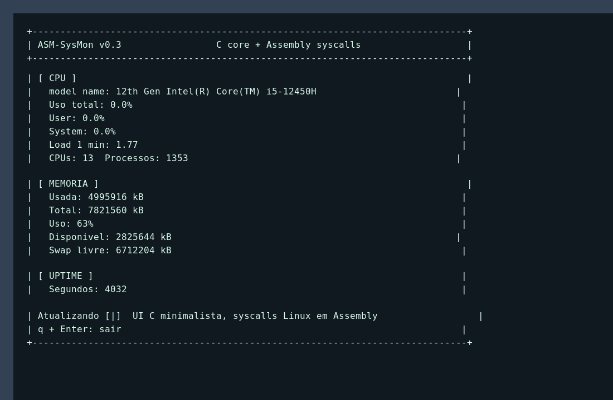

# ASM-SysMon

[](https://en.cppreference.com/w/c/11)
[](https://gcc.gnu.org/)
[](https://www.nasm.us/)
[](https://www.kernel.org/)
[](https://www.gnu.org/software/make/)

Monitor de sistema em C freestanding + Assembly x86_64 para Linux.

O projeto lê dados reais de `/proc` e renderiza uma interface de terminal no estilo DOS/UNIX. As camadas de fluxo, coleta e UI ficam em C minimalista; as chamadas críticas ao kernel permanecem em Assembly NASM com syscalls diretas.



## Objetivo

- Exibir nome do processador.
- Exibir memória total e memória disponível.
- Exibir uptime do sistema.
- Exibir uso total, user e system da CPU em tempo real.
- Exibir carga média, número de CPUs e processos observados.
- Exibir memória usada, disponível, percentual e estado do swap.
- Manter uma base modular para evoluir parsing, interface, logs e coleta de métricas.
- Separar lógica de produto em C e infraestrutura crítica em Assembly.

## Execução

```bash
make
./build/asm-sysmon
```

Para sair:

```text
q + Enter
```

## Estrutura

```text
include/constants.inc  Constantes de syscall, buffers e refresh
include/sysmon.h       Contrato C/Assembly e constantes do monitor
src/main.c             Loop principal freestanding
src/proc.c             Leitura de /proc
src/metrics.c          Parsing e cálculo de métricas de CPU e memória
src/ui.c               Renderização ANSI no terminal
src/input.c            Entrada de teclado e saída limpa
src/syscalls.asm       Wrappers de syscalls Linux
src/assets/            SVGs, screenshot e artefatos visuais versionáveis
docs/                  Documentação técnica e planejamento
```

## Documentação

- [Índice documental](docs/README.md)
- [Histórico e evolução](docs/history/linha-do-tempo.md)
- [Arquitetura](docs/architecture/arquitetura.md)
- [UML](docs/uml/diagramas.md)
- [Casos de uso](docs/use-cases/casos-de-uso.md)
- [Padrões modernos aplicados](docs/padroes-modernos.md)
- [Arquitetura em SVG](src/assets/architecture.svg)

## Importância

ASM-SysMon é útil como estudo prático de baixo nível: mostra como um programa Linux pode coletar dados do sistema, controlar terminal e organizar módulos com C freestanding e Assembly crítico, sem depender de runtime externo.
