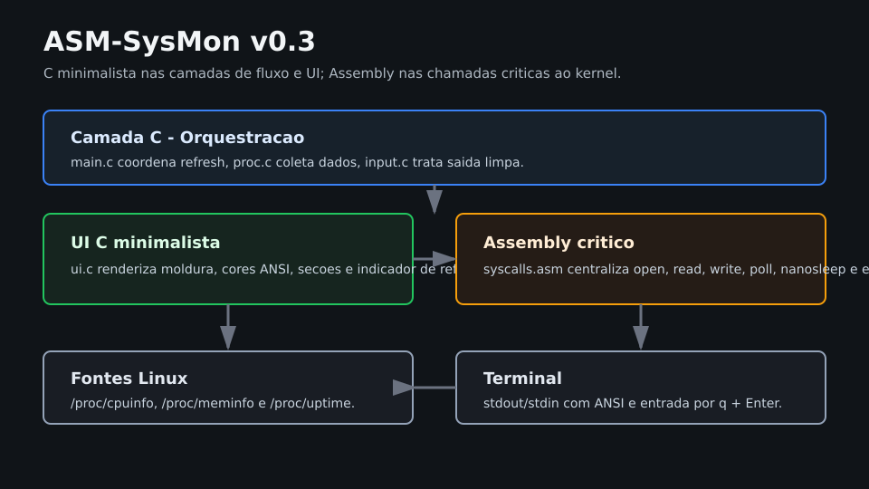

# Arquitetura

## Visão geral

ASM-SysMon segue uma arquitetura modular simples em camadas:

```text
Entrada do usuário -> input.c
                         ^
                         |
main.c -> proc.c -> syscalls.asm -> Linux kernel -> /proc
   |
   v
 ui.c -> syscalls.asm -> Linux kernel -> terminal
```



## Módulos

### `main.c`

Responsável pelo ciclo de execução:

- chama coleta de CPU, memória e uptime;
- chama renderização da UI;
- verifica entrada do usuário;
- aguarda o próximo refresh com `nanosleep`.

### `proc.c`

Responsável por abrir, ler e fechar arquivos virtuais de `/proc`.

Arquivos lidos:

- `/proc/cpuinfo`;
- `/proc/meminfo`;
- `/proc/uptime`.

### `ui.c`

Responsável por transformar buffers em saída de terminal.

Recursos atuais:

- limpeza de tela;
- moldura ASCII;
- cores ANSI;
- indicador animado;
- filtragem simples de linhas relevantes.

### `input.c`

Responsável por entrada não bloqueante simplificada:

- usa `poll`;
- lê uma tecla quando disponível;
- encerra com `q`;
- restaura cursor e cores antes do `exit`.

### `syscalls.asm`

Centraliza wrappers de syscalls:

- `read`;
- `write`;
- `open`;
- `close`;
- `poll`;
- `nanosleep`;
- `exit`.

## Decisões técnicas

- Usar C freestanding para reduzir complexidade de fluxo, parsing textual e UI.
- Não usar libc para manter foco didático em syscalls.
- Manter Assembly nas chamadas críticas ao kernel.
- Usar `/proc` como fonte de telemetria por ser padrão UNIX/Linux.
- Usar ANSI escape codes em vez de ncurses para reduzir dependências.
- Manter buffers fixos para simplificar alocação e controle de memória.

## SDLC em cascata

O projeto usa um fluxo de evolução em cascata para mudanças significativas:

1. Requisitos: definir métrica, comportamento esperado e impacto visual.
2. Projeto: atualizar arquitetura, contratos C/Assembly e artefatos visuais.
3. Implementação: alterar módulos pequenos e preservar a camada de syscalls.
4. Verificação: executar `make`, teste manual do binário e revisão dos documentos.
5. Manutenção: registrar histórico, padrões e estrutura de commit.

## Limitações atuais

- Parsing ainda é textual e simples.
- O layout assume largura aproximada de 80 colunas.
- O uptime ainda é exibido no formato bruto de `/proc/uptime`.
- A leitura de CPU e memória usa campos específicos, sem fallback por localidade.
