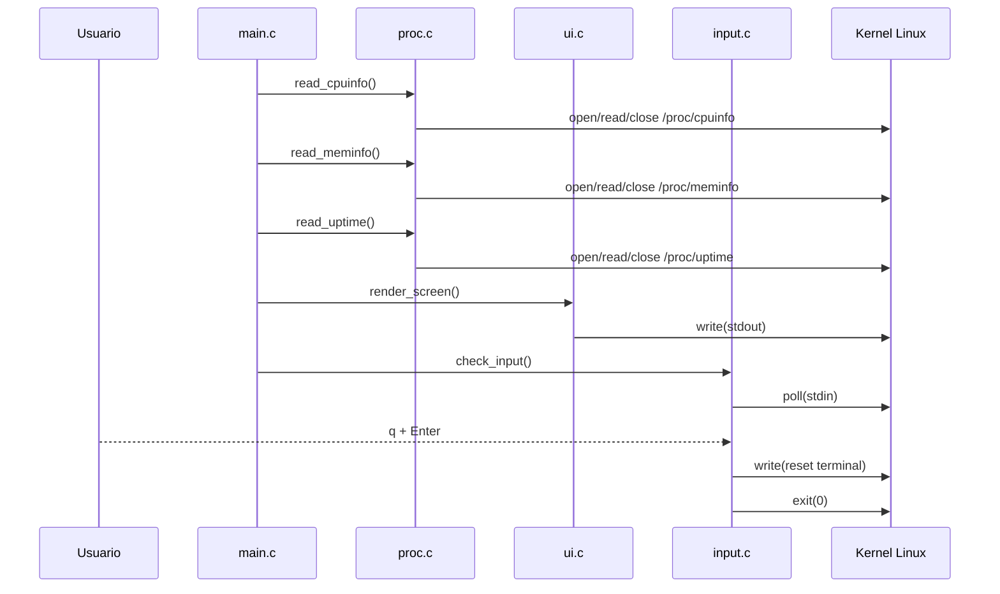
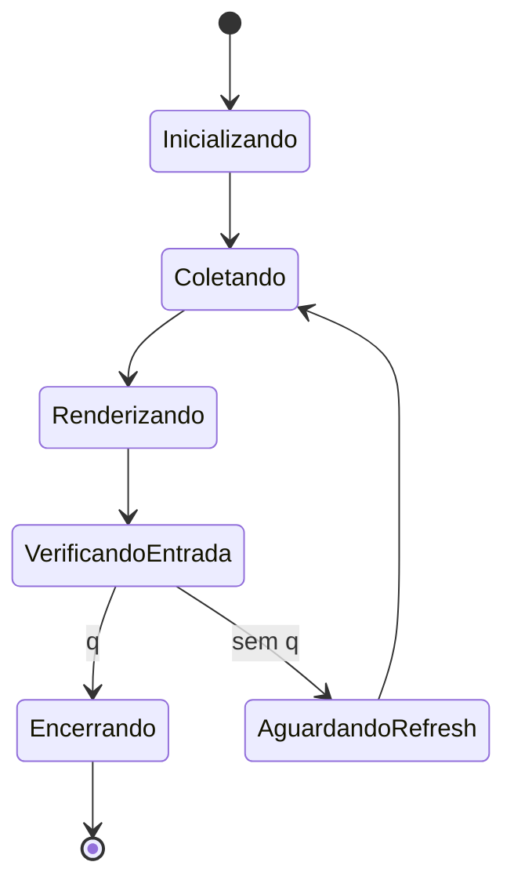
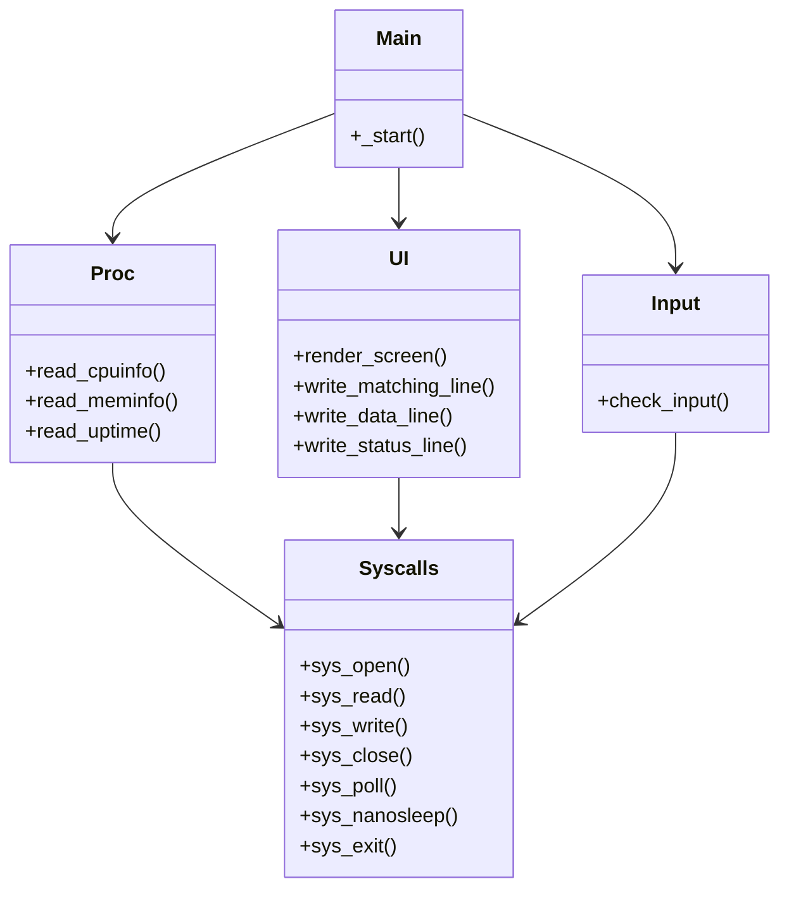

# UML e Diagramas

Os diagramas usam Mermaid para manter a documentação versionável no próprio repositório.

## Componentes

```mermaid
flowchart LR
    User[Usuario no terminal] --> Input[input.c]
    Main[main.c] --> Proc[proc.c]
    Main --> UI[ui.c]
    Main --> Input
    Proc --> Syscalls[syscalls.asm]
    UI --> Syscalls
    Input --> Syscalls
    Syscalls --> Kernel[Linux kernel]
    Kernel --> ProcFS[/proc]
    Kernel --> Terminal[stdout/stdin]
```

## Sequência de atualização



## Estados do programa



## Organização de módulos


